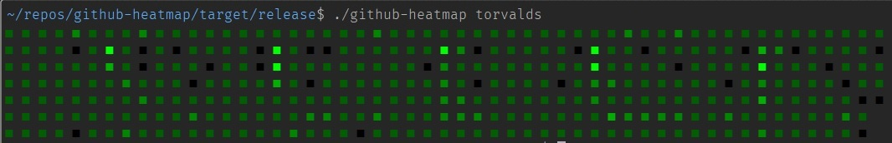
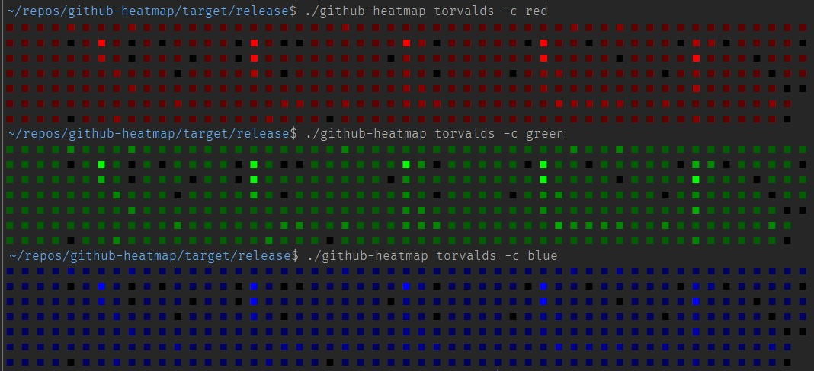
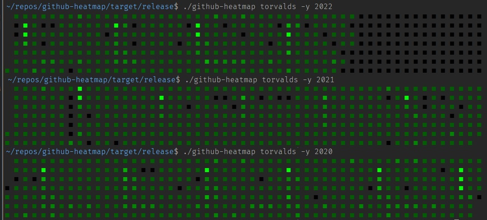

# github-heatmap

A CLI tool built with Rust to scrape a Github profile and mirror the SVG heatmap as Unicode.

This is intended to be a fun little project to play around with scraping with Rust. I know that it's not the most efficient way to get these results, especially given that Github's GraphQL API is quite extensive.

## Basic Usage

`github-heatmap <slug> <args>`

## Arguments

| Argument | Alias | Description                                                                                                 | Type                 | Default |
| -------- | ----- | ----------------------------------------------------------------------------------------------------------- | -------------------- | ------- |
| Slug     |       | Github profile slug, e.g. torvalds                                                                          | String               |         |
| --color  | -c    | Heatmap color scheme. Nodes will be shaded depending on heat level.                                         | red \| green \| blue | green   |
| --year   | -y    | Specific year to fetch contributions. If not provided, contributions will be fetched for the last 365 days. | String               |         |

### Examples

#### Default arguments

`github-heatmap torvalds`

#### Alternative Color

`github-heatmap torvalds -c blue`

#### Filter by year

`github-heatmap torvalds -y 2022`

## TODO

- [x] Error handling
- [x] Argument validation/value parsers
- [x] Testing
- [ ] Documentation
- [ ] Publish to crates.io
